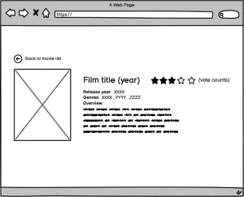

# Fall4Movies

Fall4Movies, es un proyecto estudiantil desarrollado por Alexandra Ron, para el bootcamp regional de Laboratoria  (DEV-010). 

En el ejercicio de desarrollo web, se les pidió a las estudiantes que desarrollaran un website, que mostrara un catálogo de películas, alimentado por la API [TMDB](https://www.themoviedb.org/). Para ello debíamos usar- por primera vez - REACT como framework de desarrollo. 

# Diseño de la App

Siendo un proyecto de películas, el diseño del mismo está inspirado por la Nostalgia. La paleta de colores, recuerda a los de la mítica cadena de renta de películas Block Buster Video; y el logo, es un claro ícono que recuerda a la película de culto "Vértigo", de Alfred Hitchcock. 

Se nos entregaron por parte de nuestro product owner ficticio, dos diseños de baja fidelidad que respondían a los deseos de nuestro cliente (también ficticio).  

Luego de un poco de inspiración, se diseñó un prototipo de alta fidelidad - usando la herramienta Canva - que nos guiaría por el desarrollo, más adelante. 

# Funcionalidades
## Lista de películas

// por llenar

### Funciones de filtrado

// Por llenar

### Funciones de ordenado

## Detalle de película

//Por llenar

